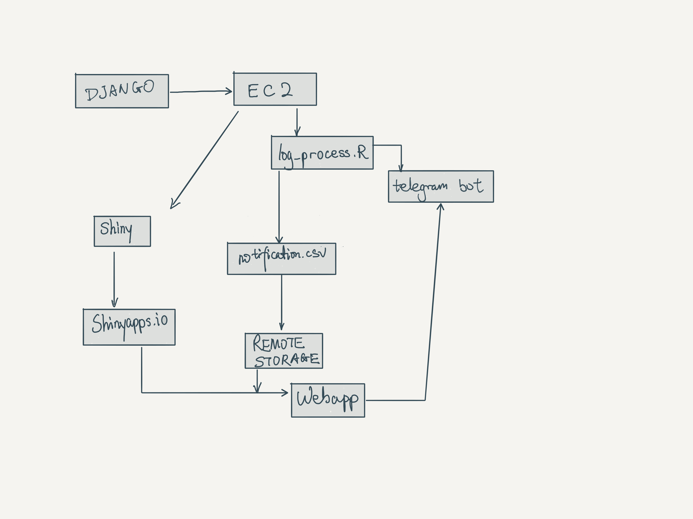
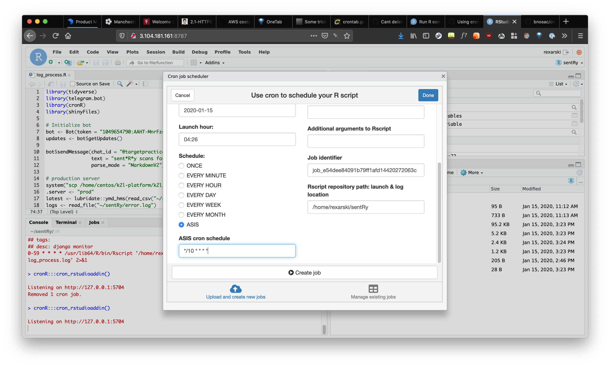

# README

## tl;dr

Perform document analysis on Django error log and summarize the information in concrete message which will be sent through Telegram bot to a specified channel. The script is automatically run at a certain frequency.

## Requirements

- R
- RStudio
- `tidyverse`, `telegram.bot`, `cronR`, `aws.s3`, `shiny`

## How to make this work

1. In telegram, create a new bot under the permission of @BotFather. Follow the order and make sure you have a valid API Token.
2. You can test the basic message functionality with `bot_script.r`. But it won't be needed in the main script.
3. You can also test run the actual process with `log_process.R`.
4. If there are problems no more, click `Addin` in RStudio and select "*Schedule R scripts on Linux/Unix*".

## Related files

- `12hourplot.png` The histogram showing error count in the last 24 hours.
- `bot_script.R` The script for testing Telegram bot creation. Will be dropped later.
- `error.log` An error log copied from Django.
- `global.R` Set up some global functions and parameters.
- `log_process.log` The console log of `log_process.R` running on the server. It is essential for debugging.
- `log_process.R` The main script which needs to run periodically.
- `notification.csv` The formatted backup of errors captured by this monitoring script. It is de facto very similar to `error.log`.
- `settings.csv` A file to save some setting parameters including the latest reported error time.

## Todo

- [x] Shiny/d3 dashboard.
- [ ] Interaction with Telegram bot.
- [ ] Slack integration.
- [ ] A better and more secure approach to save settings.
